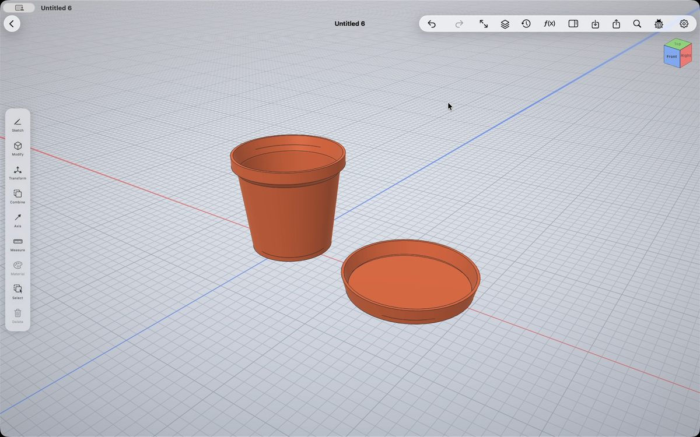
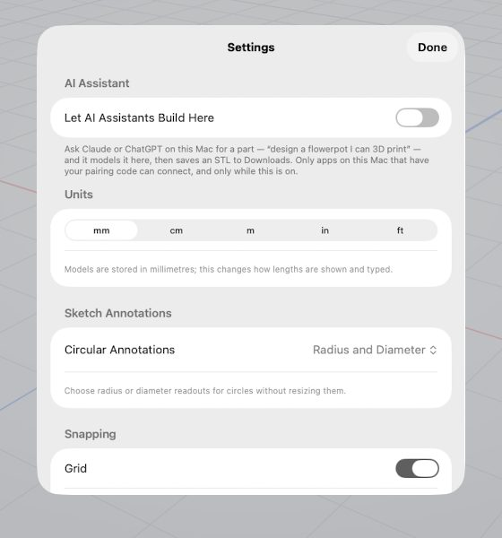
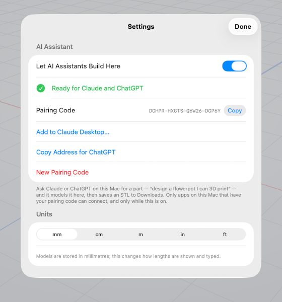
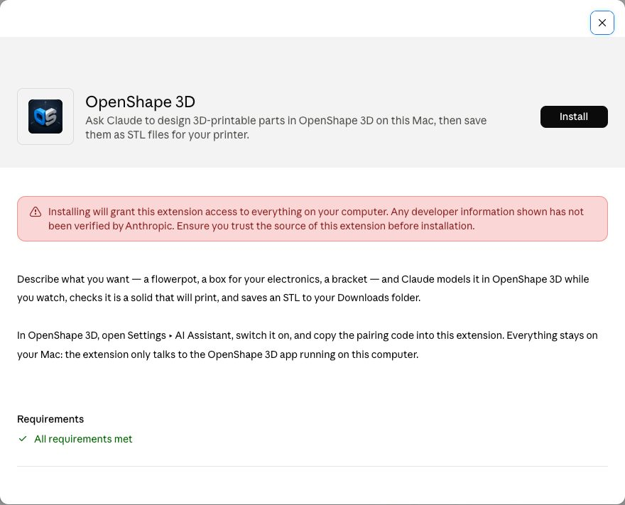
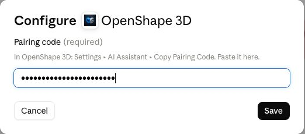
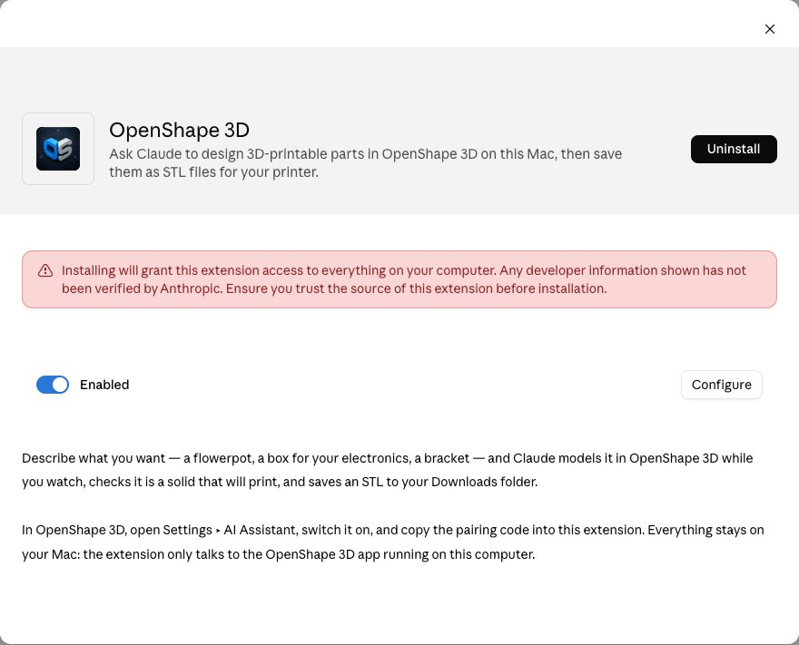
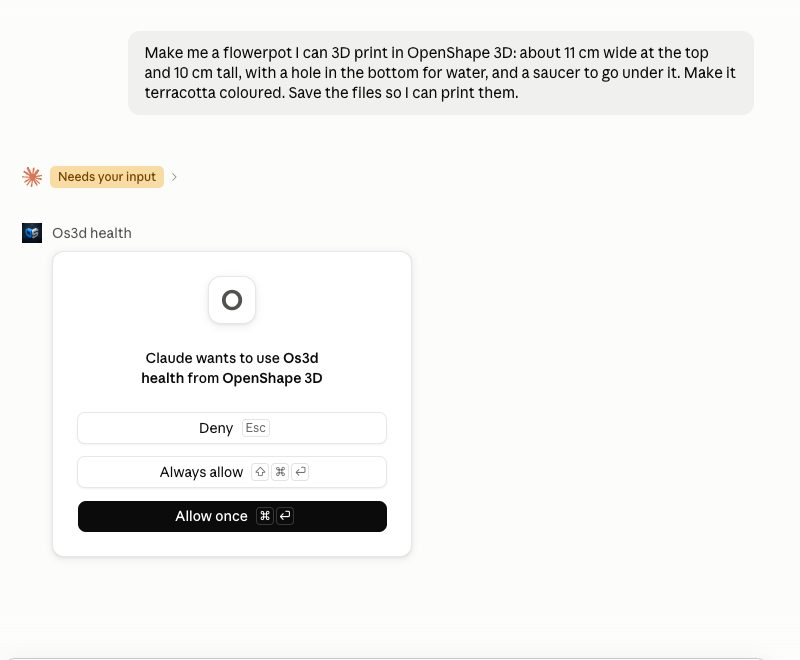
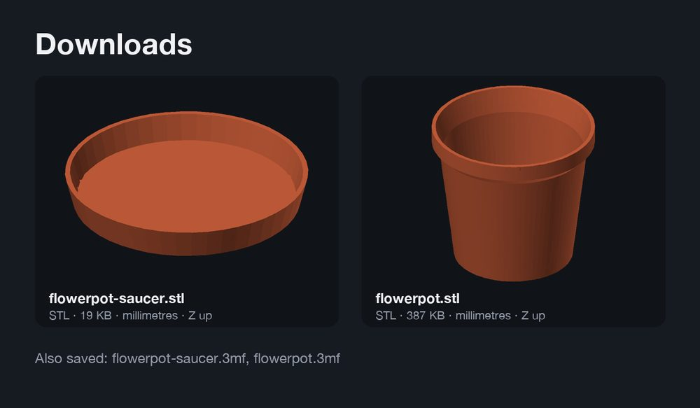

# Tutorial: design a 3D-printable part by asking Claude

You describe a part in plain English; Claude models it in OpenShape 3D on your
Mac while you watch, checks that it will print, and saves the files to your
Downloads folder. No CAD experience needed, and you never open a terminal.

*This pot and saucer came from one sentence: "Make me a flowerpot I can 3D
print, about 11 cm wide at the top and 10 cm tall, with a hole in the bottom
for water, and a saucer to go under it."*

## What you need

1. **OpenShape 3D for Mac**, version 1.3 or later (free, Mac App Store).
2. **Claude Desktop** — the Claude app for Mac, from [claude.ai/download](https://claude.ai/download).
3. **Your printer's slicer** (Bambu Studio, Cura, PrusaSlicer, OrcaSlicer…),
   to turn the finished file into a print.

Setup takes about two minutes and you only do it once.

## Step 1 — Switch it on in OpenShape 3D

1. Open OpenShape 3D and click the **gear** (top right) to open Settings.
2. The first section is **AI Assistant**. Turn on **Let AI Assistants Build Here**.
3. It turns green and says **Ready for Claude and ChatGPT**, and shows a
   **pairing code**.

| Off (the default) | On |
| :---: | :---: |
|  |  |

The switch stays off until you turn it on, and you can turn it off again at
any time. The pairing code is like a key: only an app that has it can talk to
your OpenShape 3D.

## Step 2 — Add OpenShape 3D to Claude Desktop

1. In the same Settings section, click **Add to Claude Desktop…**.
   OpenShape 3D copies your pairing code and hands Claude the extension.
2. Claude comes to the front showing the **OpenShape 3D** extension.
   Click **Install**, then **Install** again to confirm.

   

   Claude shows its standard warning that the extension is not verified by
   Anthropic. It comes from the open-source OpenShape 3D project; you can read
   every line of it in `integrations/claude-desktop/` in the repository.

3. Claude asks for the **pairing code**. Paste it (it is already on your
   clipboard) and click **Save**.

   

4. Switch the extension to **Enabled**.

   

If nothing opened in step 1, double-click **OpenShape 3D.mcpb** in your
Downloads folder; that is the same file.

## Step 3 — Ask for a part

1. In OpenShape 3D, start a blank design (or open one you want to add to).
2. In Claude, start a new chat and describe what you want, in your own words.
   Include the sizes that matter to you and say it is for 3D printing:

   > Make me a flowerpot I can 3D print in OpenShape 3D: about 11 cm wide at
   > the top and 10 cm tall, with a hole in the bottom for water, and a saucer
   > to go under it. Make it terracotta coloured. Save the files so I can
   > print them.

3. The first time Claude uses each OpenShape 3D tool, it asks your permission.
   Choose **Always allow** so it does not ask again.

   

4. Watch the part appear in OpenShape 3D, step by step. Claude explains what
   it is doing as it goes, and checks its own work: it compares the volume
   with its own arithmetic and runs the app's test that every part is a
   closed, printable solid. A pot and saucer take about a minute.

## Step 4 — Print it

When Claude is done it tells you exactly what it made — the sizes, the wall
thickness, how it checked it — and where the files are: your **Downloads**
folder, one file per part.

- **STL** files work with every slicer. **3MF** files carry the colour too.
- The files are in millimetres and already turned so the part stands on the
  print bed the way it stands in the app.
- Open a file in your slicer, slice, print. For a pot that lives outside,
  PETG or ASA holds up better than PLA, and three or four wall loops help it
  hold water.

## Changing it

Not quite right? Just say so, in the same chat:

- "Make the pot 15 cm tall instead of 10, and save it again."
- "Make the walls 4 mm thick."
- "Add three more drainage holes."

Claude rebuilds the part, checks it again, and saves new files (it never
overwrites your existing ones — the new file gets a "2" in its name). What
Claude builds is an ordinary OpenShape 3D model: every step is in the History
panel, undoable, and you can keep working on it yourself with every tool in
the app.

## Good things to ask for

Simple, solid parts with clear sizes work best: pots and planters, boxes and
lids, hooks and brackets, spacers, knobs, feet, cable clips, a stand for a
phone or a tablet. Say what it is for ("a box for a Raspberry Pi with a slot
for the cable") and the sizes you care about. Claude asks when something is
ambiguous.

## If something does not work

| What you see | What to do |
| --- | --- |
| Claude says OpenShape 3D is not reachable | Open OpenShape 3D, check Settings ▸ AI Assistant is on and says *Ready*, and that a design is open (not the gallery). |
| Claude says the pairing code was refused | Copy the code from OpenShape 3D ▸ Settings ▸ AI Assistant and paste it into Claude: Settings ▸ Extensions ▸ OpenShape 3D ▸ Configure. If you clicked *New Pairing Code*, this is why. |
| The extension shows *Disabled* in Claude | Switch it to *Enabled* (Claude installs extensions disabled). |
| Nothing opened when you clicked *Add to Claude Desktop…* | Double-click *OpenShape 3D.mcpb* in Downloads. |
| Settings says *Couldn't start* | Another program on your Mac is using the ports OpenShape 3D tries (8787–8796). Quit it, or turn the switch off and on again. |
| The part looks wrong | Tell Claude what is wrong — it can see the model's exact measurements and a picture of it — or fix it yourself in OpenShape 3D. |

## Is this safe?

- OpenShape 3D listens only on your own Mac (`127.0.0.1`), only while the
  switch is on. Turn it off and nothing can connect.
- It answers only apps that present your pairing code. Web pages are refused
  outright, code or not. **New Pairing Code** cuts off everything paired so far.
- Through OpenShape 3D, an assistant can model in the open design, look at it,
  and save exports into your Downloads folder (never over an existing file). It
  cannot open other files or reach anything else on your Mac.
- OpenShape 3D itself sends nothing to the internet. What you type to Claude,
  and the measurements and pictures of the model Claude asks the app for, go to
  Claude under Claude's own privacy terms — the same as any other chat.

## Other assistants

The same switch works with ChatGPT's desktop app (Codex) and any other MCP
client: click **Copy Address for ChatGPT** and add that address as an MCP
server, with the pairing code as its bearer token. Details, and everything
for developers, are in [AI_MODELING_SETUP.md](AI_MODELING_SETUP.md).
