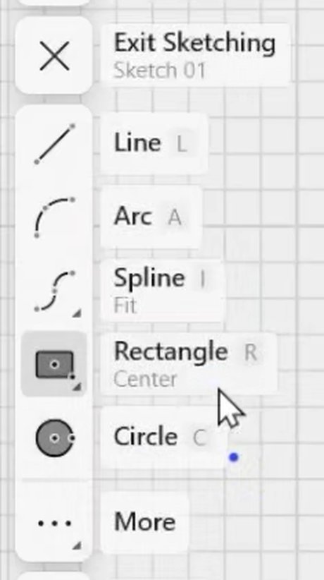
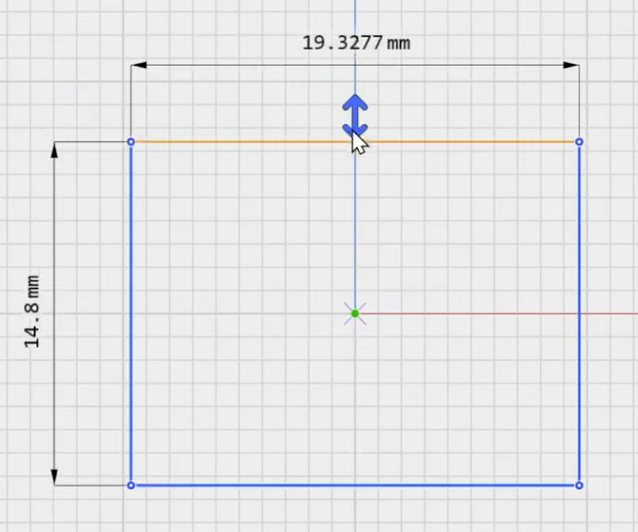
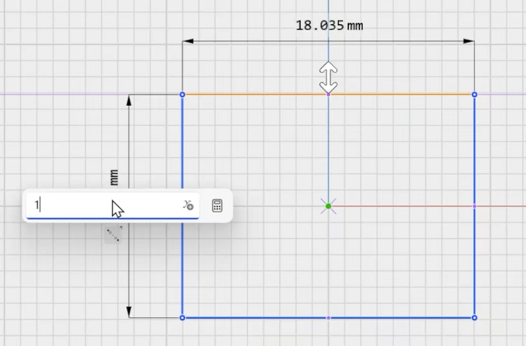
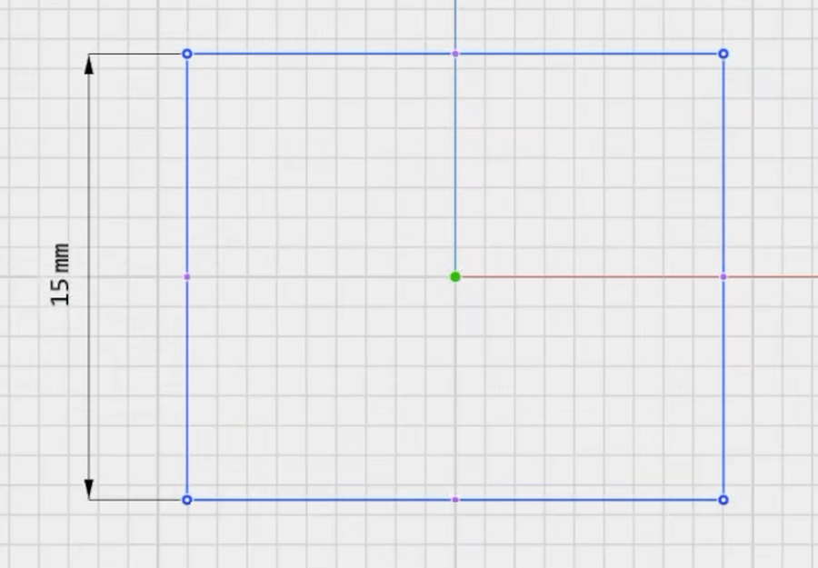
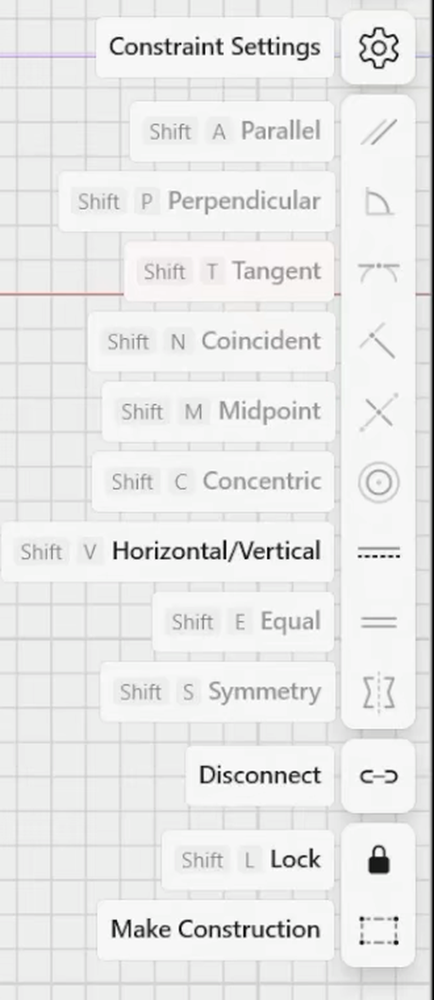
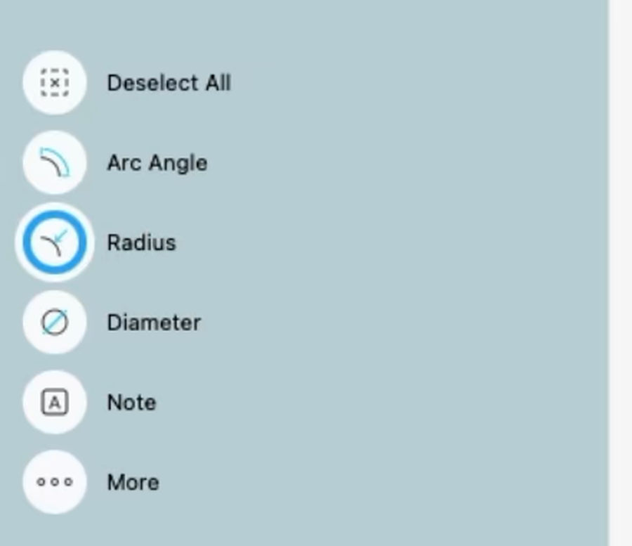
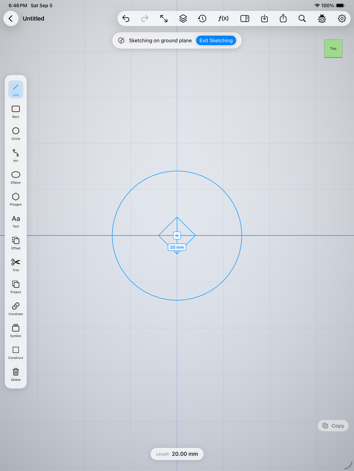
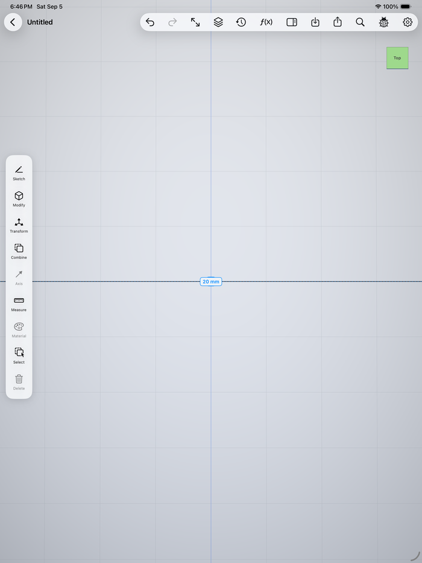
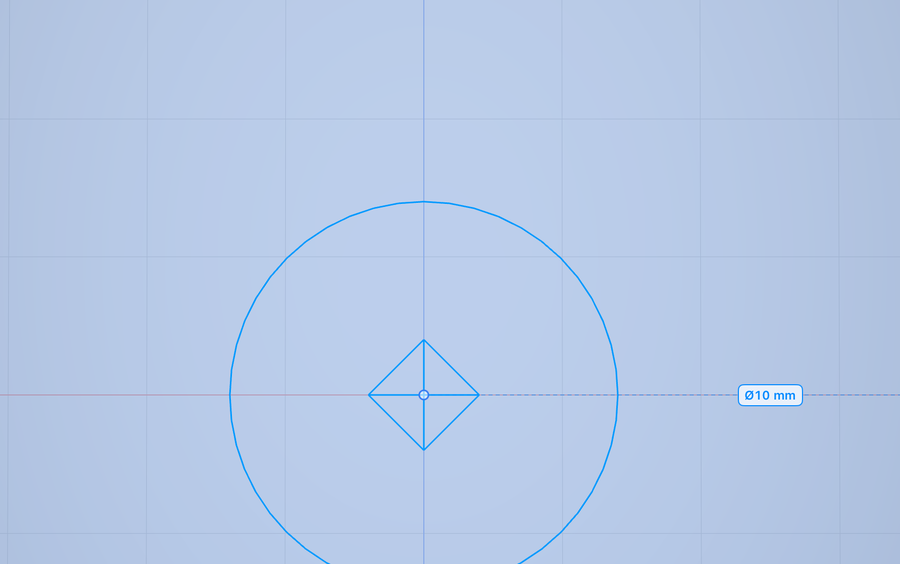
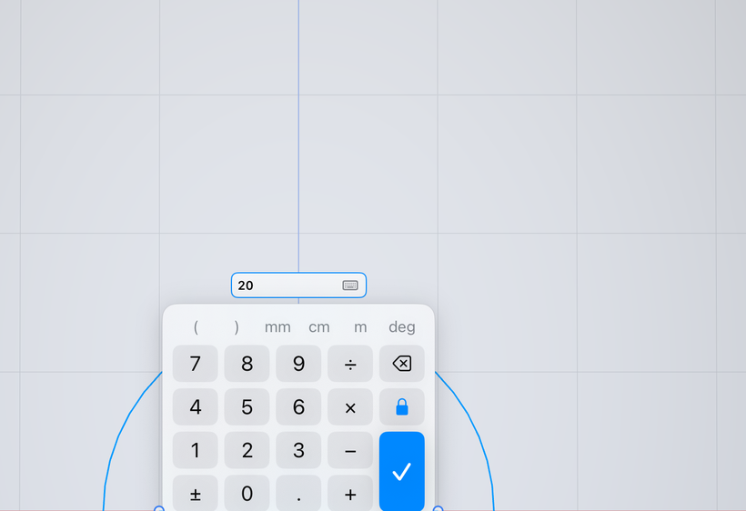

# Shapr3D sketch parity — first pass

Written 2026-09-05 against **Shapr3D 26.121.0**, installed on the dev Mac.
Scope: sketching and dimensions only. Companion docs:
`MODELING_PARITY_GOALS.md` (the roadmap this feeds), `PARITY_SPEC.md`.

## Current baseline correction — 2026-09-07

The September 5 sections below are **historical**, not the current implementation contract.
At audited revision `88b0478`, both Always Show Dimensions and Always Show Constraints default **OFF**. Off means selection-based, not hidden and not “all active sketch annotations.” The follow-up implementation filters each annotation and makes normal model-mode outline taps recover its dimensions; see [implementation ledger](SKETCH_PARITY_IMPLEMENTATION.md).

`PSTools.Dimension.*` and the shipped Dimension tutorial include **2D Drawings** features. The “ten sketch dimension tools” / G2 list below is **withdrawn as a sketch requirement**. Label dragging also needs verified sketch-specific evidence. Native Shapr3D was accessible during the September 6 audit; the old accessibility blockage below is historical. Camera behavior requires per-device UI verification, not assumptions from old notes.

## Where the reference evidence comes from

Two sources, both from the shipped binary — no recollection, no tutorials.

1. **`Contents/Resources/en.lproj/Localizable.strings`** → 3,226 keys via
   `plutil -convert json`. The product's own vocabulary: `Overlay.SketchingSubMenu.*`
   (sketch palette + constraint menu), `PSTools.Dimension.*` (all ten dimension
   tools), `Tools.*` (195 modeling-tool keys), `SnappingLabels.*`, `ErrorMessages.*`.
2. **`Contents/Resources/Tutorials.bundle/Tool/{Rectangle,Dimension}/video.mp4`** —
   Shapr3D ships screen recordings of its own UI. Every screenshot below is a
   frame from those, at 1920×1080.

Frame extraction used a small `AVAssetImageGenerator` tool; the Homebrew
`ffmpeg` on this machine is broken (missing `libx265`). Driving Shapr3D live was
not possible and not needed — UI scripting needs Accessibility, and `osascript`
returns `not allowed assistive access (-1719)`.

## How sketching works in Shapr3D

Enter a sketch by double-tapping a face, hovering it and pressing Space, or
selecting it and choosing Sketch. Tools sit on the left, and a **permanently
visible constraint rail** on the right.

Line (L), Arc (A), **Spline (I** — Fit or Control), Rectangle (R, with a
**subtype**: Center / Diagonal / 3-Point), Circle (C), Ellipse, Polygon, Offset
Edge, Trim (T), Text, Project, Pattern Sketch. Drawing auto-constrains as you
go; fully constrained geometry turns green.

While dragging, **both** of a rectangle's dimensions read live, each with its
own drag arrows:

Tapping a dimension opens a type-in field carrying a **unit selector and a
calculator button**:

And the behaviour this pass exists for — after committing, the dimension
**stays on the canvas**, witness lines and arrowheads intact, as the cursor
moves away toward Exit Sketching:

Its visibility is a setting, `Overlay.SketchingSubMenu.ConstraintSettings.Visibility`:
**"Constraint & Locked Dimension Visibility"** — *Always Show Constraints*,
*Always Show Dimensions*, or "shown based on your current selection".

The constraint rail carries all nine logical constraints, each hotkeyed, plus
Disconnect, Lock, Make Construction and Constraint Settings:

When a selection admits more than one dimension, an adaptive menu offers the
choice rather than picking for you:

## Gaps against openshape3d

| # | Gap | Status |
|---|---|---|
| **G1** | Dimensions and constraint glyphs vanished on leaving the sketch, and only ever showed for the *active* sketch | **fixed** (this pass) |
| **G6** | Dimension label text was hardcoded `"%.2f"` + `" mm"`, ignoring the display unit | **fixed** (this pass) |
| **G5** | A circle read **Ø** while you dragged it out but committed to a bare, unprefixed **radius** — two numbers for one circle, seconds apart | **fixed** (this pass) |
| **G2** | Historical ten-tool list came from 2D Drawings, not sketch mode. Use audit DM-03 / DM-04 for sketch distance-type and circle-size choices. | withdrawn; replaced by scoped audit |
| **G3** | Label position is computed; Shapr3D's badge is draggable ("Drag the Dimension badge to reposition it") | open |
| **G7** | No `Disconnect`; no `Anchored Sketch Entity` (First/Last Selected) setting | open |
| **G8** | Spline and Sketch Pattern are kernel-complete but unreachable — `SketchTool` has no `.spline` case, and `patternLinks` is untouched by `EditorViewModel` | open |

### What was wrong, precisely

openshape3d already had persistent, tappable, editable dimension labels — the
badge in `SketchDimensionOverlay` is a `Button` calling `beginDimensionEdit`,
with an inline expression-aware field and red conflict attribution. The defect
was narrower than "dimensions are missing":

- both annotation overlays were gated on `viewModel.mode.isSketching`, so
  leaving a sketch hid every dimension that defined it;
- `sketchDimensionLabels` and `sketchConstraintGlyphs` both began
  `guard let sketch = activeSketch`, so a second sketch's dimensions were never
  visible at all, no matter the mode.

### The fix

- `EditorViewModel.annotatedSketches(alwaysShow:)` — the active sketch always,
  plus every non-hidden sketch when the setting is on. The active sketch is
  included even when hidden, because `openItemSketch` renders it while editing.
  The live *candidate* label stays active-sketch-only: it belongs to the
  selection, which only exists in the sketch being edited.
- Both overlays now render when `isSketching || alwaysShow…`.
- Tapping a label or glyph from outside its sketch calls `openItemSketch` first —
  `commitDimensionEdit` and `deleteConstraint` both require it to be active.
- `AppSettings.alwaysShowDimensions` / `.alwaysShowConstraints`, defaulting
  **on**, surfaced as a **Visibility** section in `ConstraintSettingsView`.
  They read through `object(forKey:)` rather than `bool(forKey:)` so an explicit
  `false` survives a relaunch.
- **The off-state is selection-based, not hidden.** Shapr3D's own wording is
  `"Locked dimensions are shown based on your current selection."`, so with the
  toggle off a *selected* sketch still shows what defines it. Both overlays also
  gate on having something to draw rather than on the mode — they are
  full-screen and hit-testing, so an empty one would put an invisible layer over
  the viewport for taps to land in.
- **Constraints default off, dimensions default on.** A dimension you typed
  should not vanish; a canvas of `⌖ ∥ ⊥ ◎` badges over every sketch while you
  are modelling is noise, and Shapr3D does not do that by default either.
- **A full circle dimensions as a diameter** (`.diameter`), matching the `Ø` its
  own drag readout already showed via `LiveDimensionKit`; arcs and polygons keep
  radius, which is the value their centre-and-sweep is defined by. Badges now
  carry the CAD leader — `R20 mm`, `Ø40 mm` — from the same
  `LiveDimensionKit.Kind.prefix` the live readout uses, so a circle's dimension
  is never a bare ambiguous number.
- Label text now uses the existing `DisplayUnit.compactLengthString(fromMM:)`,
  which also matches Shapr3D's trimmed format ("15 mm", not "15.00 mm"). The
  edit field is seeded in display units and converted back on commit — except
  for a *formula*, whose identifiers resolve against document variables that are
  already millimetres, so converting would double-count.

## The A/B, after the fix

Captured by `DimensionUITests.testDimensionStaysOnCanvasAfterExitingTheSketch`,
which attaches both frames on every run — draw a line, dimension it to 20, then
tap Exit Sketching.

| Inside the sketch | After Exit Sketching |
|---|---|
|  |  |

The right-hand frame is the one that matters: the palette has returned to body
mode (Sketch / Modify / Transform / Combine …), so the sketch really is closed —
and the **20 mm** badge is still there, still blue, still a `Button`. Before this
change that frame was empty. The test asserts both the badge's existence and its
text, so the regression cannot come back silently.

### G5, before and after

A circle used to read `Ø40` while you dragged it out and then commit to a bare
`20 mm`. It now commits to a diameter, with the leader on the badge:

Pinned by `DimensionUITests.testCircleDiameterDimensionDrivesGeometry`, which
types 10, asserts the solved radius is 5, and asserts the badge reads `Ø10 mm`.

### The on-canvas number pad

Shapr3D does not put the system keyboard in front of a dimension — it opens a
compact pad next to the value. openshape3d now does the same:

`NumericKeypad` is a plain text editor over a `Binding<String>` and knows nothing
about sketches, so any numeric field can adopt it. What each group does:

- **`( )` and `÷ × − +` and `±`** — already worked. The pad prints the CAD
  glyphs and translates to ASCII on the way in, so `ExpressionEvaluator` parses
  them unchanged; nested parentheses and unary minus come free.
- **`mm cm m deg`** — a typed unit now BEATS the display unit: `20 cm` is 200 mm
  in an inches document. It used to be decoration, because the evaluator strips
  a trailing unit before parsing. Fixing it also fixed a latent bug — the suffix
  is letters, so `identifiers(in:)` read `cm` as a *variable*, which made
  `20 cm` a "formula" and stored that nonsense on the dimension.
- **The lock** — Shapr3D's "locked dimension". Locked (the default) records the
  value as a driving dimension. Unlocked, the value still drives the solve, so
  the geometry lands exactly where asked; it is simply not written down.
  Unlocking one that already exists deletes it and keeps the geometry.
- **The keyboard key** — hands over to the real keyboard for a variable name or
  a function, which a ten-key cannot express.

The system keyboard no longer appears for dimensions at all, which removes the
reason `clearOfKeyboard` existed for this field (it now only keeps the taller
card on screen) and takes the keyboard's own "Undo" button out of the UI tests.

### Where the pad is wired in

Every numeric field in the app now opens the pad. The sketch dimension field,
the extrude arrow pill and the move-gizmo distance stack it under the field
(they float over the Metal canvas, and a `.popover` does not reliably present
from there — it silently shows nothing). Everything else uses a popover, which
positions itself, points at the field and dismisses on an outside tap.

Bar and panel fields adopt it in one line via `.numericKeypadField(text:onCommit:)`
— a `ViewModifier`, so each site owns its open state without declaring any.

### One numeric field, not fourteen

The bars used to hold `TextField(value:format:)` everywhere. That kind of field
cannot take an expression, cannot apply live, and cannot host the pad — which
edits a `String`. All of them are now `ExpressionValueField`: scale factor,
rotate-axis angle, revolve angle, pattern count / spacing / total angle, polygon
sides, image size, offset-plane distance, radial diameter, primitive dimensions,
and the helix sheet's radius / pitch / turns.

The migration turned on a `Kind`, because not everything numeric is a length:

- `.length` — stored in millimetres, shown in the display unit. The call site
  binds RAW millimetres; wrapping in `unit.binding` as the old code did would
  convert twice.
- `.plain` — already in the terms the user reads. An angle, a count and a scale
  factor must not be scaled by the display unit; 45° is not 4.5 cm°.

Integer fields (pattern count, polygon sides) bridge through `Double` and round
on the way in, and their range moved from the binding's setter into the field's
`clamp`, so the field knows about it too.

**One deliberate behaviour change:** the helix sheet's Radius and Pitch were
bare numbers that silently meant millimetres. They are `.length` now, so they
read in the document's unit like every other length. Turns stays `.plain`.

The Variables panel keeps its keyboard on purpose — it takes variable NAMES,
which a ten-key cannot express.

## Notes for whoever picks up G2–G8

- Do not copy the ten-tool 2D Drawings dimension list into sketch mode. Follow
  the verified sketch-specific distance-type and circle-size requirements in
  audit DM-03 and DM-04 instead. Inner/outer angle and min/max badges must be
  verified in sketch mode before treating them as sketch requirements.
- Roadmap drift worth correcting: `MODELING_PARITY_GOALS.md` §G5.1 and §G5.3
  list spline and sketch pattern as open, but both are kernel-complete with
  tests — only the UI is missing.
